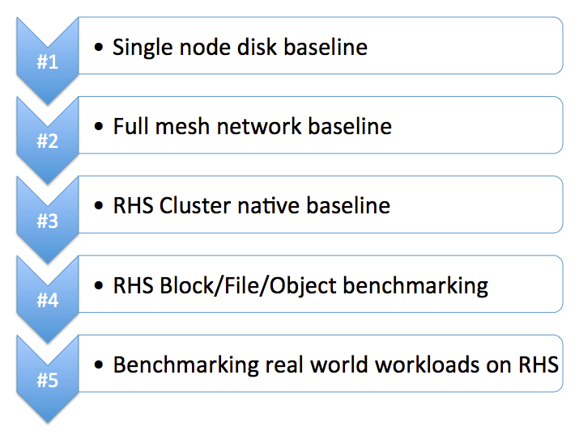

# Introduction

# Storage Architectures Team Benchmarking Process

# Benchmarking tools
- Baseline
  - Media
    - FIO
    - IOzone
  - Network
    - iperf
  - Ceph
    - Radosbench
  - Gluster
    - IOzone

- Benchmarking
  - Ceph
    - CBT
    - COSBench
  - Gluster
    - IOzone
    - SPECsfs

- Real world workload benchmarking
  - Ceph
    - Database workload
      - MySql on Ceph
    - Big Data & Analytics
      - Hadoop over S3A
    - IaaS
      - OpenStack
  - Gluster
    - PaaS workload
      - OpenShift
